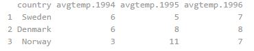
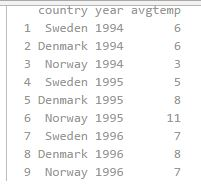
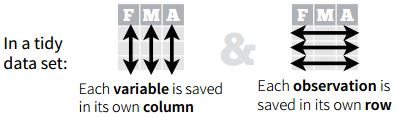
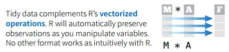
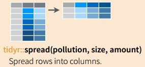
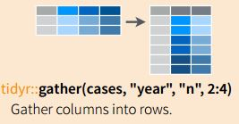
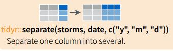
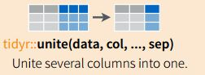

```{r echo=FALSE}

```

# “Tidy datasets are all alike but every messy dataset is messy in its own way.” – Hadley Wickham

## Outline {#Outline}
```{r Outline}
```
We are interested:

1. Wide vs. Long data
2. What is Tidy Data?
3. Vectorized operations
4. Separate vs. Unite


## Long vs. Wide Data Formats | Human vs. computer readable

<div class="columns-2">

Easiest to understand with an example.
<br><br>

<div class="blue2">
Wide Format
</div>


<br>
Quite easy for humans to read.
We are used to this format from having read tables. (Especially MS-Excel)

Note: One entity (country) has multiple values per row.
<br>
<div class="blue2">
<p><p><p>
<br><br>
Long Format
</div>

<p>
A long format is not easy for humans. But it turns out to be an excellent format for performing analysis and for plotting.
<p> Note: Only one numerical value per row (country)
</div>


## Tidy Data {.flexbox .vcenter }

Tidy data is the data that resulting from the process called `data tidying.`, The Tidy data sets have structure and working with them are easy, they’re easy to manipulate, model and visualize. Tidy data sets main concept is to arrange data in a way that each variable is a column and each observation is a row.
<br><br>



## Vectorized Operations {.smaller}

Vectorized operations is fundamental to how R operates.
Very useful once we understand how it works.



```{r}
```


## Long vs. Wide Data Formats | Converting from one to the other

We frequently end up doing this. This is also called `pivoting.`

<div class="columns-2">



<br>
R command to use: `spread()`

Part of tidyr package
<br><br><br><br><br><br>


R command to use: `gather()`

This is sometimes referred to as 'melting' a data frame
</div>


# Let's Practice with some data {.smaller}

---
Let's read the Crude Oil Data

```{r, message=F, warning=F}
library(dplyr)
```
```{r}
df <- read.csv(file='data/CrudeOilProduction.csv', stringsAsFactors = F)
us_oil <- df %>% filter(Country=="USA", Time>2010) %>% 
  select(-Indicator, -Subject, -Units, -Flag.Codes)

head(us_oil)
```
<div class="centered">
How do we convert this to a 'wide' format?
</div>

## {.build}

- `key` is the column to spread into multiple colums
- `value` is the column with *values* to spread into multiple columns

```{r}
library(tidyr)
wide <- us_oil %>% spread(key=Time, value=Quantity)
head(wide)

```

## Going from Wide to Long format {.smaller}

`mtcars` (built-in dataset) is wide.

```{r}
mtcars$car <- rownames(mtcars) #create a new column called car
rownames(mtcars) <- NULL #get rid of rownames. we don't want that since we have the `car` column
head(mtcars,4)
dim(mtcars)
```
<div class="centered blue2">
Question: If we made this into a LONG dataframe, how many rows would that have?
</div>

## Let's melt the data frame {.build}
```{r}
long_cars <- mtcars %>% gather(attribute, value, -car)
head(long_cars)
```

So who got it right?!
```{r}
dim(long_cars)
```


## Using the `separate` command




## Using the `unite` command




# End


