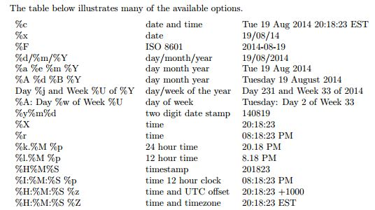

```{r echo=FALSE}

```

## Outline {#Outline}
```{r Outline}
```
We are interested:

1. Reading Dates
2. Formatting Dates
3. POSIXct & POSIXlt
4. Date Diff

## R Understands Dates

```{r}
mydate <- as.Date("7/20/2012", format = "%m/%d/%Y")
# Input is a character string and a parser
class(mydate)  # this is date

weekdays(mydate)  # what day of the week is it?
mydate + 30  # Operate on dates
```

## Formatting Dates
```{r}
starts <- c("1967-07-01", "1967-08-01", "1967-09-01", "1967-10-01", "1967-11-01", "1967-12-01")
str(starts)
as.Date(starts, format="%Y-%m-%d")
```


```{r}
# We can parse other formats of dates
mydate2 <- as.Date("8-5-2017", format = "%d-%m-%Y")
mydate2

```

## A few operations on Date

R converts all dates to numeric values, like Excel and other languages
The origin date in R is January 1, 1970

```{r}
as.numeric(Sys.Date())  # days since 1-1-1970
```
```{r}
Sys.Date() + 180
```


## {.flexbox .vcenter .emphasized}

POSIX 

## POSIXct

POSIXct is the number of seconds since 1 January 1970.

```{r}
(ct <- Sys.time())
class(ct)
str(ct)
ct
```


## POSIXlt

POSIXlt (local time) stores the date and time as a named list of vectors.
These vectors can then be accessed.


```{r}
(ct <- as.POSIXlt(ct))
class(ct)
str(ct)
```
## 

```{r}
ct$year #NOTICE!!
ct$mon
ct$hour
ct$mday
ct
```

## And to access all the lt elements

```{r}
unclass(ct)
```
## There are many formatting options

See help for `strptime()` 




## Computing Elapsed Times

Often, we have to calculate time differences

```{r}
mydate2 - mydate
library(ggplot2)
diff <- economics$date[2] - economics$date[1]
diff
```
```{r}
units(diff) <- "hours"
diff
```


# End


