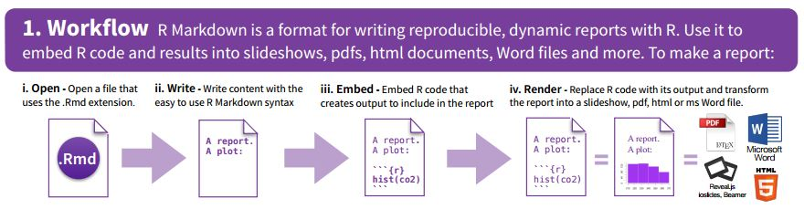
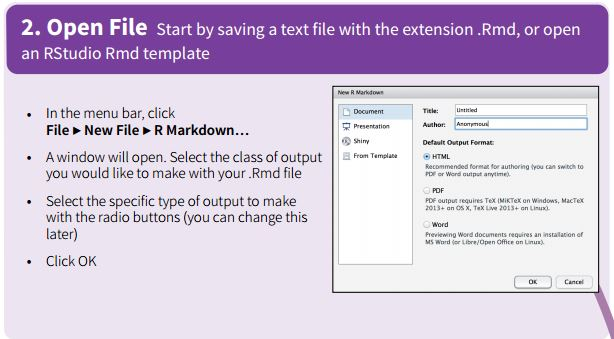
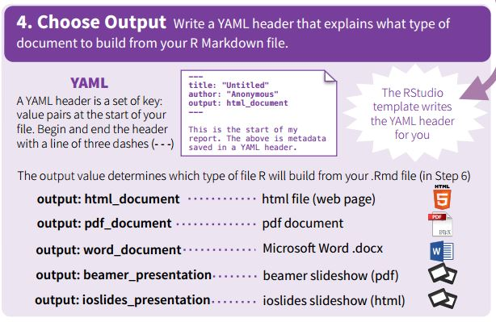
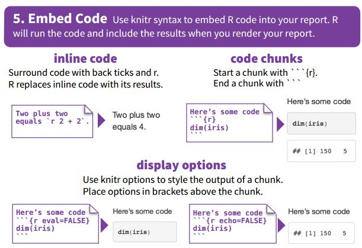
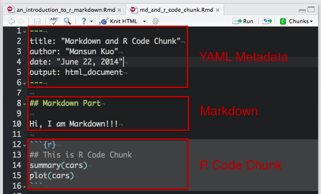
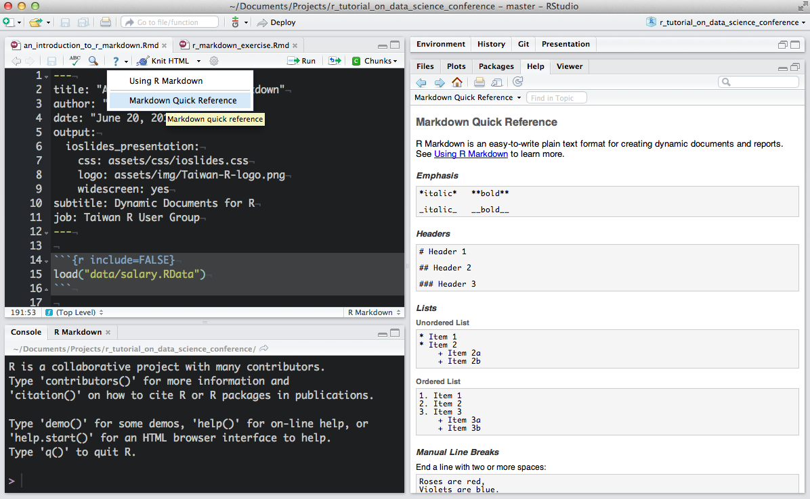
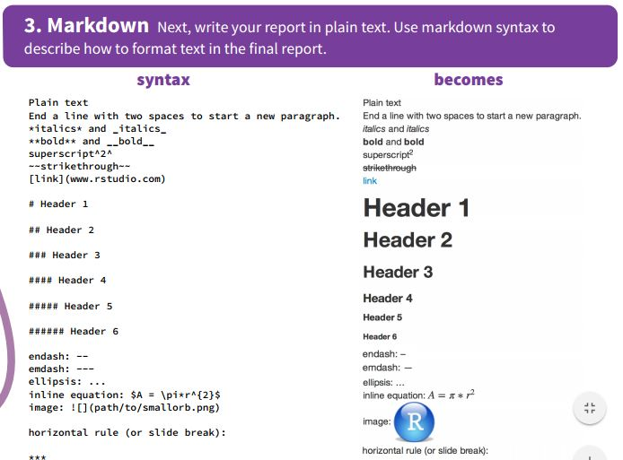
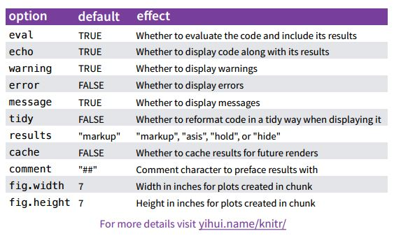
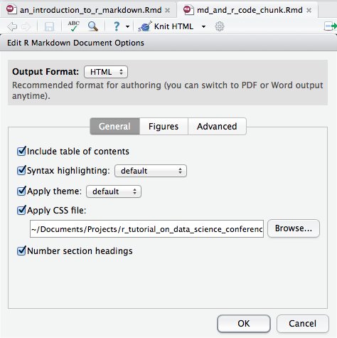

## Acknowledgement
These slides are derived from Mansun Kuo's presentation
[https://github.com/mansunkuo/rmd_tutorial](https://github.com/mansunkuo/rmd_tutorial)

## Outline {#Outline}
```{r Outline}
```
We are interested in 2 takeaways:

- Markdown Basics
- Embedding R Code Chunks

## R Markdown

What is Markdown?

A convenient tool to generate reproducible document.

**R Markdown is a format for writing reproducible, dynamic reports with R.**

We can use it to embed R code, and results and text into slideshows, pdf, html documents, Word files.

- Why R Markdown
    - Consolidate your code and document into single file.
    - Easy for version control.

## Workflow



## Starting a Document



## How do we want our output?




## Embedding code into the document




## Installing R Markdown

- RStudio --- Just make sure you have the [latest version of RStudio](http://www.rstudio.com/ide/download/preview)

And don't forget to install 2 packages
```
install.packages(knitr)
install.packages(rmarkdown)
```

* *Always download all dependencies*


## The Rmd Documents have 3 types of sections

1. YAML Metadata: [YAML](http://en.wikipedia.org/wiki/YAML) to specify document options
2. Markdown: Where we write *explanations*, *notes* and comments.
3. R Code Chunk: Executible R code




## Rendering Output

- RStudio: "Knit" command (**Ctrl+Shift+K**)
- Command line: `rmarkdown::render` function
```r
rmarkdown::render("input.Rmd")
```

## {.flexbox .vcenter .emphasized}

Let's take a closer look at Markdown


# Markdown Basics
```{r Markdown Basics}
```

## Markdown Quick Reference



Has this moved in the newer version of RStudio?


## Markdown Cheatsheets

[https://www.rstudio.com/wp-content/uploads/2015/02/rmarkdown-cheatsheet.pdf](https://www.rstudio.com/wp-content/uploads/2015/02/rmarkdown-cheatsheet.pdf)


## Emphasis

Use asterisks `*` or underlines `_` for emphasis
```markdown
*italic*   **bold**

_italic_   __bold__
```

*This text is in italics*   

**This is bold**


## Headers

There are two common styles. 

One is called `Setext`:


```markdown
Header 1
=============

Header 2
-------------
```

The other is `atx`:

```markdown
# Header 1

## Header 2

### Header 3
```

## Creating Lists

<div class="columns-2">
```html

Unordered List:

* Item 1
* Item 2
    + Item 2a
    - Item 2b


Ordered List (Numbered):

1. Item 1
2. Item 2
3. Item 3
    + Item 3a
    + Item 3b


```

Unordered List:

* Item 1
* Item 2
    + Item 2a
    - Item 2b

Ordered List (Numbered):

1. Item 1
2. Item 2
3. Item 3
    + Item 3a
    + Item 3b

</div>

## Links

A plain http address or add a link to a phrase.

**Inline Link:**

```html
[2014 Conference](http://twconf.data-sci.org/)
```
[2014 Conference](http://twconf.data-sci.org/)

**Reference Link**:


```html
[2014 Conference][dsc]

[dsc]: http://twconf.data-sci.org/
```
[2014 Conference][dsc]

[dsc]: http://twconf.data-sci.org/

Basically, you name the link and specify where it should link to.

## Images


<div class="columns-2">

**Inline Image**:

```html


```


<br><br>
<br><br>


**Usage to Refer to an Image**:

A different usage

```html
![City of Florence][Duomo_Image]

[Duomo_Image]: images/duomo_wikimedia.jpg
```
![City of Florence][Duomo_Image]

[Duomo_Image]: images/duomo_wikimedia.jpg
</div>

## Blockquotes

<pre>
  ```markdown
  A friend once said:
  
  > It's always better to give
  > than to receive.
  ```
</pre>

```markdown
A friend once said:

> It's always better to give
> than to receive.
```

## Plain Code Blocks

- Plain code blocks are displayed in a fixed-width font but not evaulated.

    <pre class="markdown"><code>&#96;&#96;&#96;
    This text is displayed verbatim / preformatted
    &#96;&#96;&#96;
    </code></pre>

- You can also specify the language of the block ex. R

    <pre><code>```r
    x = rnorm(10)
    ```</code></pre>

    ```r
    x = rnorm(10)
    ```

## Horizontal Rule / Page Break

Three or more asterisks or dashes:

```markdown
******

------
```

## Tables

<div class="columns-2">
```html
First Header  | Second Header
------------- | -------------
Content Cell  | Content Cell
Content Cell  | Content Cell


```

First Header  | Second Header
------------- | -------------
Content Cell  | Content Cell
Content Cell  | Content Cell

</div>


## MD Basics summarized




# R Code Chunks
```{r R Code Chunks}
```


## Overview

R code will be evaluated and printed


<!--pre class="prettyprint lang-r"><code>&#96;&#96;&#96;{r}-->
<pre class="markdown"><code>&#96;&#96;&#96;{r}
summary(cars$dist)
&#96;&#96;&#96;
</code></pre>


```{r}
summary(cars$dist)
```


## Named R code chunk. 

<pre class="markdown"><code>&#96;&#96;&#96;{r plot}
summary(cars)
plot(cars)
&#96;&#96;&#96;
</code></pre>

- Easy Navigation in RStudio  

    


## Basic Chunk Options

- `echo`(TRUE): whether to include R source code in the output file
- `eval`(TRUE): whether to evaluate the code chunk
- `message`(TRUE): whether to preserve messages emitted by message()
- `include`(TRUE): if include=FALSE, nothing will be written into the output document, but the code is still evaluated and plot files are generated
- `warning`(TRUE): whether to preserve warnings in the output 

Set global chunk options:

```r
knitr::opts_chunk$set()
```
## Understanding the various Knitr options




## Plots

- `dev`('png'): figure format(png, jpeg, tiff, svg, ...)
- `fig.path`('figure/'): figure path
- `fig.width`(7): figure width
- `fig.height`(7): figure height
- `dpi`(72): DPI (dots per inch)

<pre class="markdown"><code>&#96;&#96;&#96;{r dev='svg', fig.path='myplot', fig.height=8}
plot(iris)
&#96;&#96;&#96;
</code></pre>


## Caching (Optional)

- `cache`(FALSE): whether to cache a code chunk to improve proformance for expensive computing

- If you run into problems with cached output, you can always clear the knitr cache by removing the folder named with a `_cache` suffix.


## Inline R Code

```
```{r eval=FALSE}
  I counted `r 6+8` red trucks on the highway.
```
```

```r
I counted `r 6+8` red trucks on the highway.
```


## ggvis code

```{r message=FALSE, echo=TRUE, fig.height=2.5}
library(knitr)
library(ggvis)
mtcars %>%
    ggvis(x = ~wt, y = ~mpg) %>%
    layer_smooths(se=TRUE, opacity := 0.5, opacity.hover := 0.75) %>% 
    layer_points(fill = ~factor(cyl), size := 50, size.hover := 200) %>%
    set_options(hover_duration = 250)
```


## ggvis

```{r message=FALSE, echo=FALSE}
library(knitr)
library(ggvis)
mtcars %>%
    ggvis(x = ~wt, y = ~mpg) %>%
    layer_smooths(se=TRUE, opacity := 0.5, opacity.hover := 0.75) %>% 
    layer_points(fill = ~factor(cyl), size := 50, size.hover := 200) %>%
    set_options(hover_duration = 250) #%>%
#     add_tooltip(function(data){paste0("Wt: ", data$wt, "<br>", "Mpg: ", as.character(data$mpg))}, "hover")
```
 
## Setting Output Options with RStudio

With Rstudio, You can edit various output options with friendly UI.

<div class="columns-2">

```
---
title: "Analysis of R data for Industry"
author: "Your Name"
date: "Today's date"
output:
  html_document:
    css: assets/css/custom.css
    fig_caption: no
    fig_height: 5
    fig_width: 7
    highlight: default
    keep_md: no
    number_sections: no
    theme: default
    toc: yes
---
```

To get to this, click the Gear icon and choose "Output Options"


</div>

## References
    
- [R Markdown Cheat Sheet](http://shiny.rstudio.com/articles/rm-cheatsheet.html)
- [R Markdown](http://rmarkdown.rstudio.com/)
- [knitr](http://yihui.name/knitr/)
- [RStudio Documentation](https://support.rstudio.com/hc/en-us/categories/200035113-Documentation)
- [Reproducible Research](https://www.coursera.org/course/repdata)


