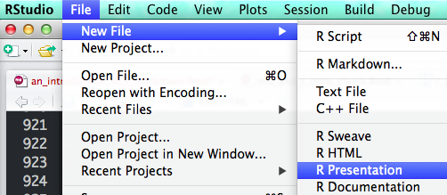
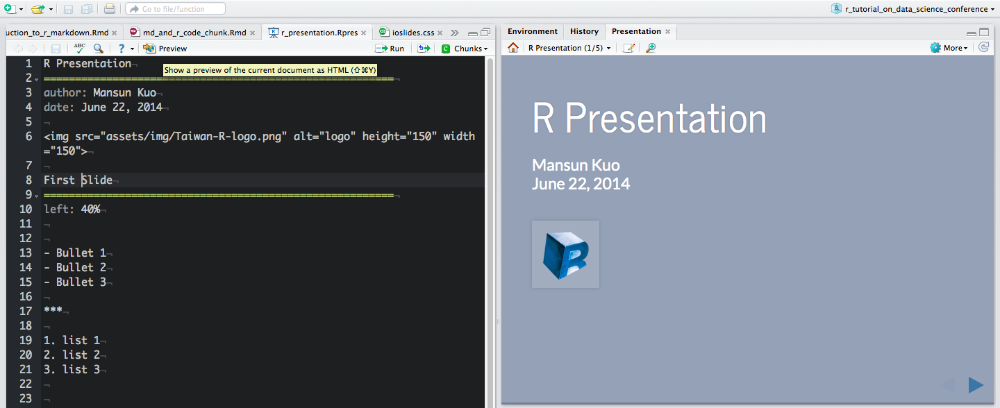
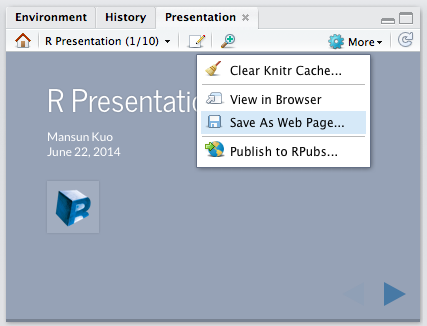
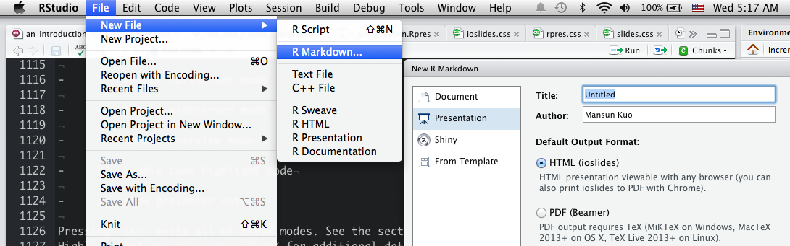

# R Presentation
```{r R Presentation}
```


## Overview

- A feature of RStudio that enable easy authoring of HTML5 presentations based on R Markdown.
- Special Feature
    - Extensive support for authoring and previewing presentations within the RStudio IDE
    - Flexible two column layouts
- Getting Started  




## Slide Basics

Set global option in first slide.

```yaml
R Presentation
========================================================
author: Mansun Kuo
date: June 22, 2014
```

Slides automatically display their titles unless `title: false` is specified.

```yaml
Slide 1
====================================
title: false

- Bullet 1
- Bullet 2
- Bullet 3
```

## Preview

- Every time you save your presentation the preview is refreshed and navigated to whatever slide you were editing.
- Within the preview pane, you can press the Edit button on the toolbar to jump immediately to it's location in the source file.




## Two Column Layout


```yaml
Two-Column Slide
====================================
left: 70%

First column
***
Second column
```

## Transitions

- `transition`: transition style
    - none, **linear**, rotate, fade, zoom, concave

- `transition-speed`: transition speed
    - **default**, slow, fast

```yaml
R Presentation
========================================================
author: Mansun Kuo
date: June 22, 2014
transition: rotate
transition-speed: fast
```


## Slide Type

- `type`: slide appearance
    - section, sub-section, prompt, alert

```yaml
Type
========================================================
type: sub-section
incremental: true
```


## Incremental Display

- `incremental`: display content incrementally
    - true, **false**

```yaml
Incremental Display
========================================================
incremental: true

- Bullet 1
- Bullet 2
- Bullet 3
```


## Preview -> More

- `Clear Knitr Cache`: clear knitr cache for this presentation
- `View in Browser`: view the presentation in an external web browser
- `Save AS Web Page`: save the presentation as a standalone web page 
- `Publish to RPubs`: publish the presentation to [RPubs](https://rpubs.com/)




## Custom CSS

```yaml
R Presentation
========================================================
author: Mansun Kuo
date: June 22, 2014
css: assets/css/rpres.css
```


## Applying Styles

Apply to individual slides:

```yaml
My Slide
===================================
class: illustration
```

Apply to spans of text:


```html
My Slide
================================== 
<span class="emphasized">Pay attention to this!</span>
```


# ioslides
```{r ioslides}
```


## Overview

- A feature of RStudio that create an [ioslides](https://code.google.com/p/io-2012-slides/) presentation.
- Special Feature
    - Code Highlighting
    - Presenter mode
- Getting Started  




## Section

- `#`: create a section
- `##`: create a new slide
- `---`: create a new slide without a header(horizontal rule)
- `|`: add a subtitle


```yaml
# section

## slide 1

---

## slide 2 | with subtitle
```


## Display Modes

-   `'f'` enable fullscreen mode

-   `'w'` toggle widescreen mode

-   `'o'` enable overview mode

-   `'h'` enable code highlight mode

-   `'p'` show presenter notes

-   `'Esc'` exits all of these modes.


## Incremental Bullets

```yaml
---
output:
  ioslides_presentation:
    incremental: true
---
```

Render bullets incrementally for specific slide:

```markdown
> - Eat eggs
> - Drink coffee
```

> - Eat eggs
> - Drink coffee


## Presentation Size

- `widescreen`: widescreen mode
- `smaller`: smaller text

```yaml
---
output:
  ioslides_presentation:
    widescreen: true
    smaller: true
---
```

Set smaller text for specific slide:

```markdown
## Getting up {.smaller}
```


## Transition Speed

`transition`: **default**, slower, faster

```yaml
---
output:
  ioslides_presentation:
    transition: slower
---
```

## Build Slides {.build}


Let content be displayed incrementally.

```markdown
## Build Slides {.build}
```


## Adding a Logo

Add a 128x128 logo:

```yaml
---
output:
  ioslides_presentation:
    logo: logo.png
---
```


## Code Highlighting

Using `### <b>` and `### </b>` to enclose the lines you want to highlight.


```r
### <b>
x <- 10
### </b>
y <- 20
```

## Center {.flexbox .vcenter}

<div class="centered">
To center content on a slide:

```html
## Center {.flexbox .vcenter}
```

To horizontally center content:

```html
<div class="centered">This text is centered.</div>
```
</div>


## Two-column 

Note that the content will flow across the columns.

```html
<div class="columns-2">
  

  - Bullet 1
  - Bullet 2
  - Bullet 3
</div>
```


## Text Color

You can color content using base color classes red, blue, green, yellow,
and gray (or variations of them e.g. red2, red3, blue2, blue3, etc.).

```html
<div class="red2">
This text is red
</div>
```

```{r results='asis', echo=FALSE}
library(whisker)
temp = '<span class="{{color}}{{number}}">{{color}}{{number}}</span>'
numbers = c("", "2", "3")
colors = c("red", "blue", "green", "yellow", "gray")
for (color in colors){
    cat("- ")
    for (number in numbers){
        out = whisker.render(temp)
        cat(out)
    }
    cat("\n")
}
```


## Presenter Mode


<div class="columns-2">

To enable presenter mode:

```html
mypresentation.html?presentme=true
```

To disable presenter mode:

```html
mypresentation.html?presentme=false
```

<div class="notes">
    This is my note.
    - It can contain markdown
    - like this list
</div>


</div>

To add presenter notes:

```html
<div class="notes">
This is my note.
- It can contain markdown
- like this list
</div>
```

